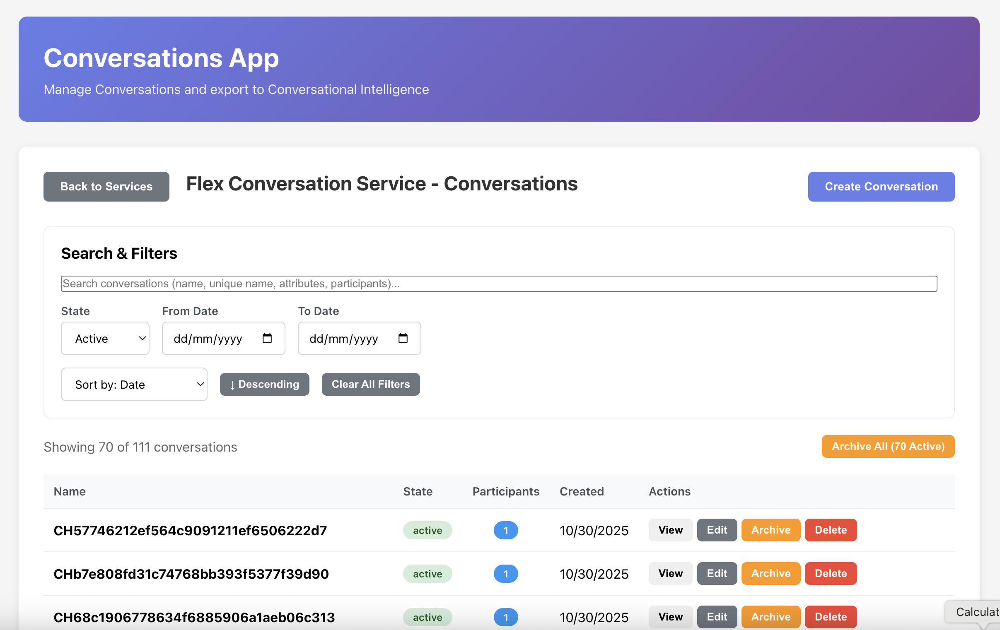

# Standalone Conversations App with Intelligence Export

A complete, standalone application for managing Twilio Conversations with integrated Conversational Intelligence Export functionality and Stytch B2B authentication.

## Key Features

### Export Conversations
This app implements the `/Export` endpoint from the **Twilio Conversations API**, ensuring that messaging conversations (chat, WhatsApp, SMS, email) are exported to Twilio Conversational Intelligence Services.

### Stytch B2B Authentication
Secure user authentication using Stytch magic links with organization management.



## Quick Start

### 1. Configure Stytch Authentication

**Create a Stytch B2B Project:**
1. Go to [Stytch Dashboard](https://stytch.com/dashboard)
2. Create a new B2B project (or use an existing one)
3. Navigate to **API Keys** to get your credentials
4. Copy your **Project ID** and **Secret**
5. In **Dashboard Settings**, configure:
   - Enable **Frontend SDKs** in Test environment
   - Add `http://localhost:5173` to **Authorized domains**
   - Enable **Create organizations** toggle under Enabled methods
6. In **Redirect URLs**, add: `http://localhost:5173/auth/callback`

**Configure Backend (.env):**

Create `server/.env` file:
```bash
PORT=3001

# Stytch B2B Authentication
STYTCH_PROJECT_ID=project-test-xxxxxxxx-xxxx-xxxx-xxxx-xxxxxxxxxxxx
STYTCH_SECRET=secret-test-xxxxxxxxxxxxxxxxxxxxxxxxxxxxxxxx

# Session Secret (generate a random string for production)
SESSION_SECRET=your-random-session-secret-key

# Optional: Customize redirect URL
DISCOVERY_REDIRECT_URL=http://localhost:5173/auth/callback
CLIENT_URL=http://localhost:5173
```

**Configure Frontend (.env):**

Create `client/.env` file (optional, uses defaults):
```bash
VITE_API_URL=http://localhost:3001
```

### 2. Install Dependencies

**Server:**
```bash
cd server
npm install
```

**Client:**
```bash
cd client
npm install
```

### 3. Start the Server

```bash
cd server
npm start
```

Server runs on `http://localhost:3001`

### 4. Start the Client

```bash
cd client
npm run dev
```

Client runs on `http://localhost:5173`

### 5. Access the App

1. Open `http://localhost:5173` in your browser
2. **Sign in with Stytch:**
   - Enter your email address
   - Click "Send Magic Link"
   - Check your email and click the link
   - You'll be redirected to the app, authenticated
3. **Configure Twilio Credentials** (if prompted):
   - Enter your Twilio Account SID and Auth Token
4. Start managing conversations!

## Features

- **Stytch B2B Authentication**:
  - Magic link login (passwordless)
  - Organization management
  - Session-based security
  - Automatic session refresh
- **Full CRUD for All Resources**:
  - Conversation Services (Create, Read, Update, Delete)
  - Conversations (Create, Read, Update, Delete)
  - Messages (Create, Read, Update, Delete)
  - Participants (Create, Read, Delete)
  - Webhooks (Create, Read, Update, Delete)
- **Export to Intelligence** - The key feature using Conversations API `/Export`
- **Operator Results Viewing** - View AI analysis (summaries, classifications, extractions)
- **Clean, Modern UI** - Easy to use interface
- **Server-side Credentials** - Secure credential management

## The Export Fix

### What Makes This Different?

The `/Export` endpoint is **part of the Conversations API** and exports:
- Chat conversations
- WhatsApp messages
- SMS via Conversations API
- Email thread conversations

### How It Works

1. Create a Conversation Service
2. Create Conversations with messages
3. Click "Export to Intelligence"
4. Select an Intelligence Service
5. Export creates a transcript of your **conversation messages**
6. View the transcript automatically

## Project Structure

```
Conversations-App/
  server/                    # Backend Express server
    middleware/
      stytchAuth.js         # Stytch session validation middleware
    index.js                # Main server with Stytch auth & API endpoints
    package.json
    .env                    # Stytch credentials (not committed)
    .env.example            # Template for environment variables
    test-export-endpoint.js
  client/                    # React frontend with Vite
    src/
      contexts/
        AuthContext.jsx     # Auth state management
      pages/
        ConversationsApp.jsx # Main app page
      components/
        auth/
          StytchLogin.jsx   # Magic link login form
          AuthCallback.jsx  # Magic link callback handler
          ProtectedRoute.jsx # Route protection wrapper
      services/
        apiClient.js        # API client with credentials support
      styles/
        ConversationsApp.css
      main.jsx              # App entry with routing
    index.html
    vite.config.js
    package.json
    .env.example            # Template for frontend env vars
  README.md                  # This file
```

## API Endpoints

### Complete API Reference

For the full API documentation including all CRUD operations, see **[API_REFERENCE.md](API_REFERENCE.md)**

### Key Endpoints Summary

**Authentication (Stytch)**
- `POST /auth/login` - Send magic link to email
- `GET /auth/authenticate` - Handle magic link callback
- `GET /auth/session` - Check current session status
- `POST /auth/logout` - Revoke session and logout
- `GET /auth/member` - Get current member info (protected)

**Credentials**
- `POST /api/credentials` - Save Twilio credentials
- `GET /api/credentials/status` - Check credentials status
- `DELETE /api/credentials` - Clear credentials

**Conversation Services** (Full CRUD)
- List, Create, Update, Delete services

**Conversations** (Full CRUD, service-scoped)
- List, Get, Create, Update, Delete conversations

**Messages** (Full CRUD)
- List, Send, Update, Delete messages

**Participants** (Create, Read, Delete)
- List, Add, Delete participants

**Webhooks** (Full CRUD)
- List, Create, Update, Delete webhooks

**Export to Intelligence** (Key Endpoint)
- `POST /conversations/services/:serviceSid/conversations/:conversationSid/export`
  - Exports conversation messages to Intelligence Service
  - Returns transcript SID for operator results

**Intelligence**
- List Intelligence Services
- Get transcripts
- Get operator results (AI analysis: summaries, classifications, extractions)

## Testing

Run the test script to verify the export endpoint:

```bash
cd server
npm test
```

This will:
1. Check server health
2. Verify credentials
3. List services and conversations
4. Test the export endpoint
5. Confirm transcript creation

## Usage Guide

### Creating Your First Conversation

1. **Create a Service**: Click "Create Service" and enter a name
2. **Create a Conversation**: Select the service, click "Create Conversation"
3. **Add Messages**: Open the conversation, go to Messages, click "Send Message"
4. **Add Participants**: Go to Participants tab, click "Add Participant"

### Exporting to Intelligence

1. **Open a Conversation**: Click "View" on any conversation with messages
2. **Click "Export to Intelligence"**
3. **Select Intelligence Service**: Choose from your available services
4. **Click "Export"**
5. **View Transcript**: The transcript will appear automatically after 2-3 seconds

## Security Notes

### Authentication
- All routes protected by Stytch session validation
- Magic link authentication (passwordless)
- HTTP-only session cookies
- Automatic session refresh
- Organization-level access control

### Credentials
- Twilio credentials stored server-side in `.credentials.json`
- Stytch secrets stored in `.env` (never exposed to frontend)
- Session secrets use secure random strings
- Never commit `.env` or `.credentials.json` to version control
- The `.gitignore` file is configured to exclude sensitive files

### Production Recommendations
- Use HTTPS in production (`secure: true` for cookies)
- Generate strong random session secrets
- Use environment variables or secret managers
- Configure proper CORS origins
- Enable rate limiting for auth endpoints

## Troubleshooting

### Export Not Working
- Ensure you have messages in the conversation
- Verify Intelligence Service SID is correct (starts with `GA`)
- Check server logs for errors

### No Intelligence Services
- Create an Intelligence Service in Twilio Console
- Ensure your credentials have access to Intelligence API

### Transcript Not Appearing
- Wait 2-5 seconds for processing
- Check transcript status via Intelligence API
- Ensure messages exist in the conversation

## Additional Documentation

- **[API_REFERENCE.md](API_REFERENCE.md)** - Complete API documentation with all CRUD endpoints
- **[QUICK_START.md](QUICK_START.md)** - Detailed setup instructions
- **[IMPLEMENTATION_SUMMARY.md](IMPLEMENTATION_SUMMARY.md)** - Technical details and architecture

## Twilio Documentation

- [Conversations API](https://www.twilio.com/docs/conversations)
- [Export Endpoint](https://www.twilio.com/docs/conversations/api/conversation-resource#export-a-conversation)
- [Intelligence API](https://www.twilio.com/docs/intelligence)

## Key Takeaway

**The `/Export` endpoint is part of the Conversations API**, not the Voice API. It's specifically designed for exporting text-based conversations (chat, WhatsApp, SMS) to Intelligence Services for analysis.

## License

This is a demonstration application.
